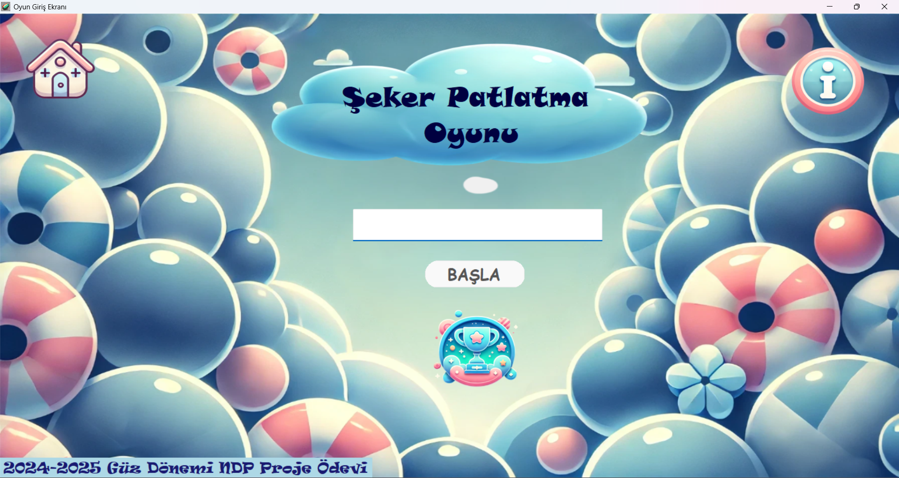
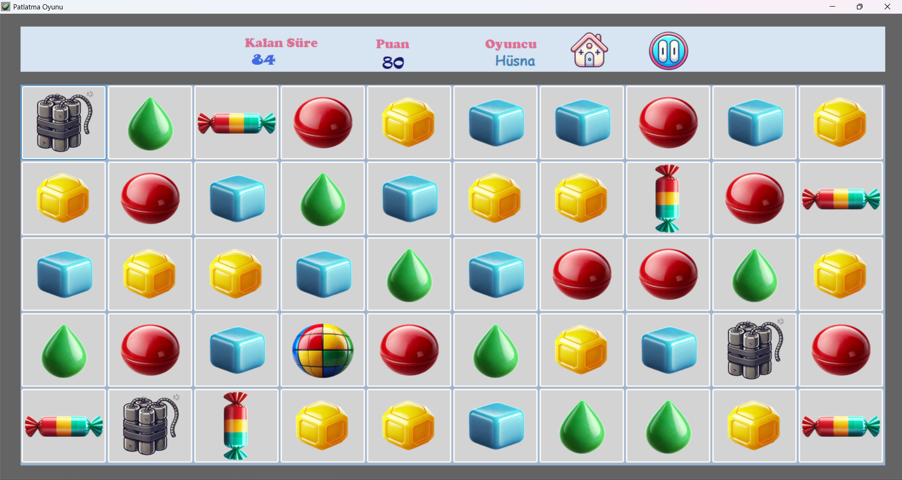
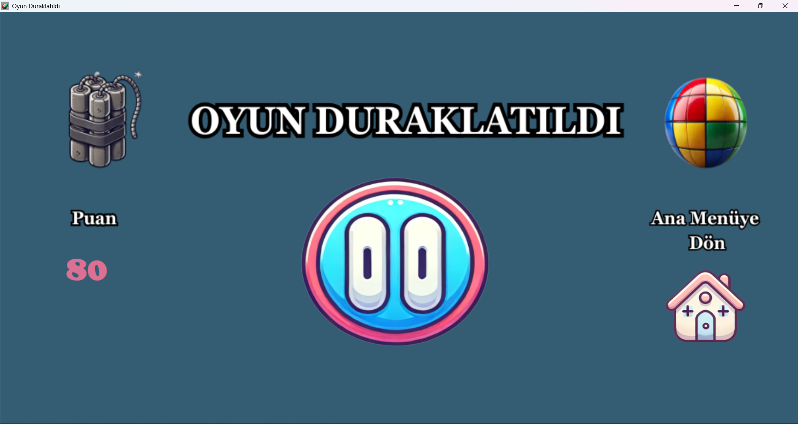
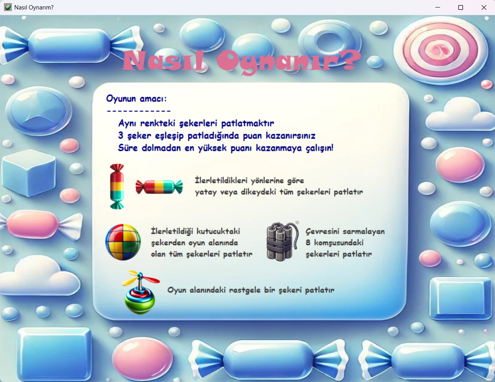

# 🍬 Şeker Patlatma Oyunu

<p align="center">
  
</p>

C# Windows Forms kullanılarak geliştirilen bu proje, klasik Candy Crush oyun mekaniğinden ilham alınarak hazırlanmış bir eşleştirme (Match-3) oyunudur.

Oyuncular aynı tür şekerleri eşleştirerek puan kazanır ve farklı özel şeker kombinasyonlarıyla yüksek skor elde etmeye çalışır.

---

# 🎮 Oyun Özellikleri

✨ Match-3 oyun sistemi  
✨ Süre tabanlı oyun mekaniği  
✨ Skor sistemi  
✨ Özel şeker mekanikleri  
✨ Patlama efektleri  
✨ Duraklatma ekranı  
✨ Yardım/Tutorial ekranı  
✨ Çoklu form yapısı  
✨ Eğlenceli kullanıcı arayüzü  
✨ High score sistemi  

---

# 🛠️ Kullanılan Teknolojiler

| Teknoloji | Açıklama |
|---|---|
| C# | Ana programlama dili |
| Windows Forms | Arayüz geliştirme |
| Visual Studio | Geliştirme ortamı |
| .NET Framework | Proje altyapısı |

---

# 📸 Oyun Görselleri

## 🏠 Ana Menü

<p align="center">
  
</p>

---

## 🎲 Oyun Ekranı

<p align="center">
  
</p>

---

## ⏸️ Duraklatma Ekranı

<p align="center">
  
</p>

---

## ❓ Nasıl Oynanır?

<p align="center">
  
</p>

---

# 🧠 Oyun Mekanikleri

Oyunda oyuncu:

- Aynı renkteki şekerleri eşleştirerek puan kazanır
- Özel şeker kombinasyonları oluşturabilir
- Süre bitmeden en yüksek puanı elde etmeye çalışır
- Farklı özel güçleri stratejik şekilde kullanabilir

---

# 💣 Özel Şekerler

| Şeker Türü | Özellik |
|---|---|
| Çizgili Şeker | Yatay veya dikey tüm satırı patlatır |
| Renk Bombası | Aynı türdeki tüm şekerleri yok eder |
| Dinamit | Çevresindeki alanı patlatır |
| Helikopter Şeker | Rastgele şeker patlatır |

---

# 📂 Proje Yapısı

```text
CandyCrushGame
│
├── Oyun.sln
├── screenshots/
├── projeOyun/
│   ├── Form1.cs
│   ├── Form2.cs
│   ├── Form3.cs
│   ├── Program.cs
│   ├── Resources/
│   └── Properties/
```

---

# 🚀 Projeyi Çalıştırma

1. Repository’yi klonlayın

```bash
git clone https://github.com/husnaOzdemir/CandyCrushGame.git
```

2. `Oyun.sln` dosyasını Visual Studio ile açın

3. Projeyi çalıştırın

---

# 👩‍💻 Geliştirici

**Hüsna Özdemir**

Bilgisayar mühendisliği öğrencisi olarak yazılım geliştirme, veri odaklı projeler ve kullanıcı deneyimi odaklı uygulamalar üzerine çalışmalar yapmaktayım.

---

# ⭐ Not

Bu proje eğitim ve geliştirme amacıyla hazırlanmıştır.
